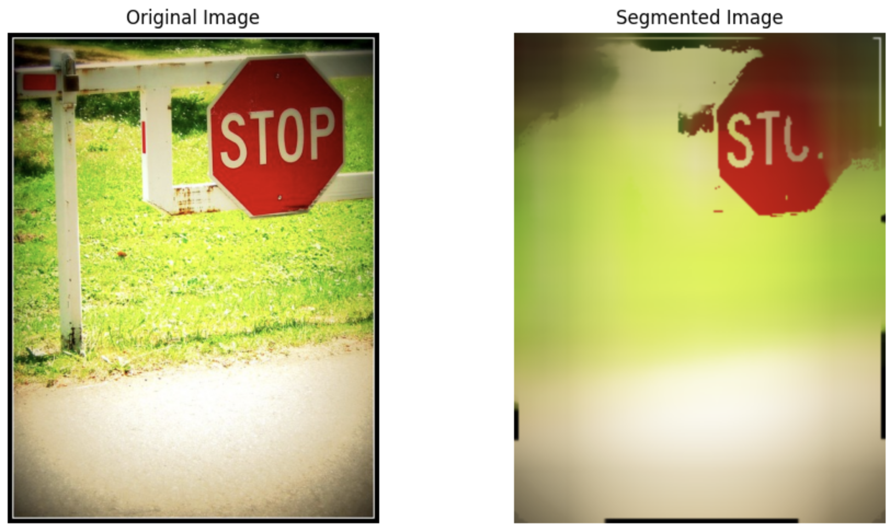
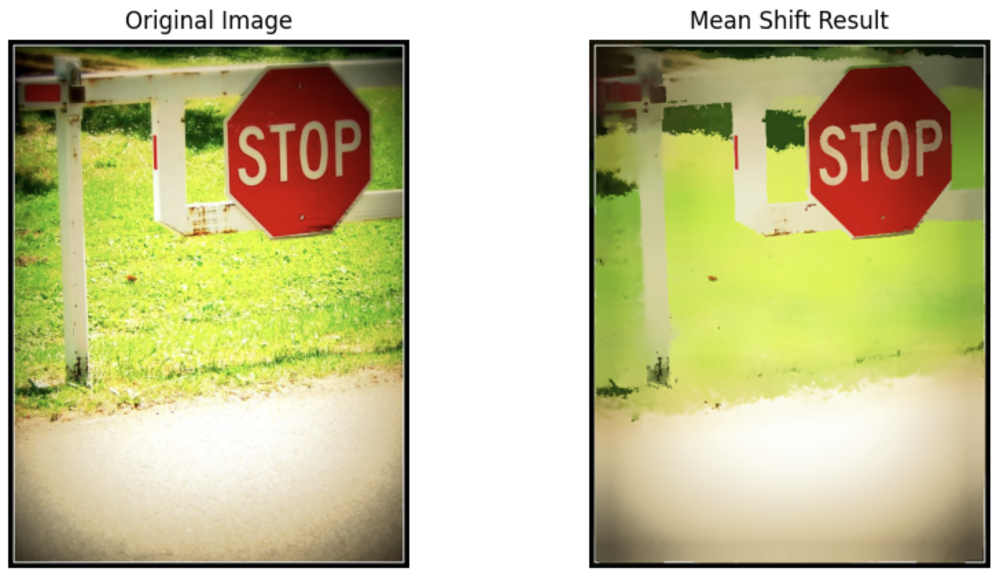
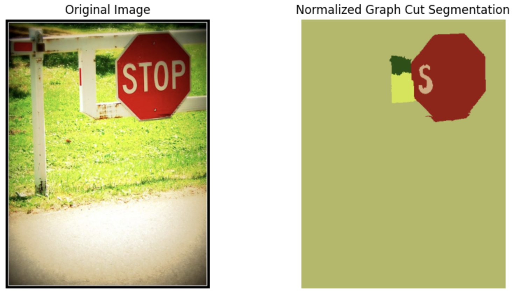

# Image Segmentation with Mean Shift and Graph Cut

This project explores **image segmentation** using different approaches and compare results:

| Method             | Description                                   |
|--------------------|-----------------------------------------------|
| Custom Mean Shift  | Uses spatial + color filtering from scratch   |
| OpenCV Mean Shift  | Faster, optimized version (pyrMeanShiftFiltering) |
| Graph Cut (GrabCut)| Semi-supervised segmentation with bounding box |

---

## Custom Mean Shift Implementation

We start by implementing the full Mean Shift pipeline manually:

### Features

- Uses spatial position + RGB color to form 5D feature space  
- Applies Gaussian kernel weighting  
- Shifts each pixel toward the **local mode** in feature space  

### Key Parameters

- `spatial_radius` – how far around each pixel to search  
- `color_radius` – allowable color difference  
- `epsilon` – convergence threshold  
- `max_iterations` – iteration cap  
- `downscale_factor` – image resizing for speed

### Example Output

 

---

## OpenCV Mean Shift

To benchmark the implementation, we also use:

```python
cv2.pyrMeanShiftFiltering(img, sp, sr)
```

- `sp` = spatial window radius  
- `sr` = color window radius

### Output

| OpenCV Mean Shift |
|-------------------|
|  |

We can see the results are slightly better using the cv2 library, but the difference is minimal.

---

## Graph Cut Segmentation

We use **GrabCut** from OpenCV for comparison:

```python
cv2.grabCut(img, mask, rect, bgdModel, fgdModel, iterCount, mode)
```

- Requires an initial rectangle around the object  
- Learns background/foreground via graph optimization

### Output

| Graph Cut (GrabCut) |
|---------------------|
|  |

---


